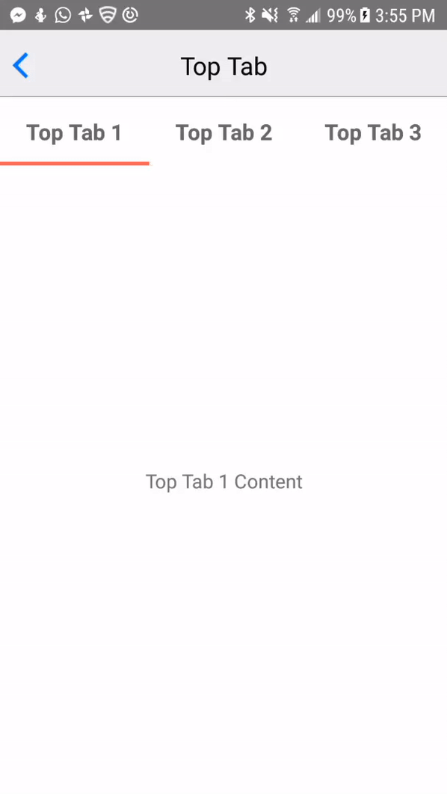

# rn-animated-tabs
> A react native animated tab bar

## Installation

```sh
npm i rn-animated-tabs -S
```

## Demo

Make sure to check out the full working [demo](https://github.com/damianlajara/rn-animated-tabs/tree/master/example) for more usage. It shows how to customize and align the tabbar in different positions.

### Running the Demo
1. `cd example`
2. `npm i && react-native run-[android|ios]`

## Examples
You can check out the [docs folder](https://github.com/damianlajara/rn-animated-tabs/tree/master/docs) for more gifs/screenshots



### Code Example

```jsx
import React, { Component } from 'react';
import { StyleSheet, View, Text } from 'react-native';
import RNAnimatedTabs from 'rn-animated-tabs';
const DATA = ['Top Tab 1 Content', 'Extra Stuff for Top Tab 2', 'More stuff for Top Tab 3'];

export default class TabTop extends Component {
  constructor(props) {
    super(props);
    this.state = {
      currentTab: 0
    }
  }

  handleTabChange = (value) => this.setState({ currentTab: value });

  render() {
    return (
	  <View style={styles.container}>
	    <RNAnimatedTabs
	      tabTitles={['Top Tab 1', 'Top Tab 2', 'Top Tab 3']}
	      onChangeTab={this.handleTabChange} />
	     <View style={[styles.container, styles.center]}>
	       <Text>
	         {DATA[this.state.currentTab]}
	       </Text>
	     </View>
     </View>
    );
  }
}

const styles = StyleSheet.create({
  container: {
    flex: 1
  },
  center: {
    justifyContent: 'center',
    alignItems: 'center'
  }
});

```

## API
| Name        			    | Type     | Default  | Required | Description |
|:-------------------------|:---------|:---------|:---------|:------------|
| tabTitles                | Array    | None     |   ✓      | The text    |
| onChangeTab              | Function | None     |   ✓      | Callback function that gets triggered when the tab button onPress is fired. It's called with the index as an arg    |
| initialActiveTabIndex    | Number   | 0        |          | Determines what tab gets marked active on mount    |
| top   			           | Boolean  | false    |         | Determines whether the active tab indicator should be rendered on top or below the component. Useful in order to position the tabbar at the top or bottom of a view.    |
| height   				    | Number   | 60       |         | The height of the tab container    |
| currentTab   			    | Number   | null     |         | Useful if you want a controlled component where you determine what tab is pressed manually. See demo for example use case    |
| containerStyle   		    | Object   | {}       |         | Allow to override the style of the tab view container    |
| tabButtonStyle   		    | Object   | {}       |         | Allow to override the style of each button in the tab view    |
| tabTextStyle   		    | Object   | {}       |         | If `renderTabContent` is not specified, then allow to override the default content view    |
| renderTabContent   	    | Function | None     |         | Overrides the default behaviour of displaying each title. Use if you want more fine-grain control over customizing the tabs. Get's called with the title and index as args. See demo for more details    |
| activeTabOpacity   	 	| Number    | 0.8      |         | The active opacity of the tab button `TouchableOpacity`    |
| activeTabIndicatorHeight | Number   | 3        |         | The height of the animated indicator for each active tab    |
| activeTabIndicatorColor  | String   | #FE5F55  |         | The color of the animated indicator for each active tab    |


## Contributions
Contributions are welcome. I'll be happy to merge any PR's.
